<div align="center">

# Hi, I'm Luna 👋
### 🐾 一只时睡时醒时扑腾的大型猫科动物

[](https://github.com/lunaticlegacy)
[](https://github.com/lunaticlegacy)
[](https://github.com/lunaticlegacy)

</div>

---

## About Me

- 🎓 GIS 本科毕业，正在读计算机科学第二学位  
- 💻 主力：**C++ / Python (PyTorch) / Java / Agentic Coding**
- 🔧 玩过：ESP32；前端会一点 HTML/CSS/
- 📚 正在学：TypeScript、Go、Agent 相关的东西  
- 🧠 状态：有焦虑，但持续推进中

---

## Tech Stack

<p>
  
  
  
  
  
  
  
</p>

---

## C++ Self-Intro

<details>
<summary>Click to expand</summary>

```cpp
#include <array>
#include <cstdint>
#include <iostream>
#include <string_view>
#include <utility>

struct HomoSapiens {
    virtual ~HomoSapiens() = default;
    virtual void introduce(std::ostream& os = std::cout) const = 0;
};

class LunaticLegacy final : public HomoSapiens {
public:
    static const LunaticLegacy& instance() {
        static const LunaticLegacy self;
        return self;
    }

    void introduce(std::ostream& os = std::cout) const override {
        os << kNekoMimi << '\n'
           << "Hi, I'm " << github_id() << " (" << gitee_id() << ")\n"
           << "Age    : " << +age() << '\n'
           << "Gender : " << gender() << '\n'
           << "Email  : " << email() << "\n\n"
           << "Q&A\n"
           << "----------------------------------------\n";

        for (const auto& [q, a] : kProfileQA) {
            os << "Q: " << q << '\n'
               << "A: " << a << "\n\n";
        }
    }

private:
    LunaticLegacy() = default;

    static constexpr std::string_view kNekoMimi =
R"(   /\_/\
  ( o.o )
   > ^ <)";

    static constexpr std::array<std::pair<std::string_view, std::string_view>, 7> kProfileQA{{
        {"有什么技能", "C++、Python（尤其 PyTorch）、Java；玩过 ESP32；前端会一点 HTML/CSS/JS，计划学习 TypeScript。"},
        {"喜欢做什么", "摸鱼、写代码、写奇奇怪怪的小说文本（C++ daisuki）。"},
        {"计划中要学什么", "Lingua Latina、Esperanto、日本語、More C++、Rust、Git、社交能力、Angular 等。"},
        {"正在面对什么", "GIS 本科毕业，已启动计算机科学第二学位。焦虑但在推进。"},
        {"喜欢打什么游戏", "最近不太想打游戏。"},
        {"一句话介绍一下你自己吧", "🐾 一个摸鱼的大型猫科动物。"},
        {"为什么要用 C++ 的方式介绍自己", "因为喜欢这种事情。"}
    }};

    static constexpr std::uint8_t age() noexcept { return 22; }
    static constexpr std::string_view gender() noexcept { return "boy"; } // femboy.substr(3)
    static constexpr std::string_view email() noexcept { return "lunaticlegacy@163.com"; }
    static constexpr std::string_view github_id() noexcept { return "lunaticlegacy"; }
    static constexpr std::string_view gitee_id() noexcept { return "LunaNeko"; }
};

int main() {
    LunaticLegacy::instance().introduce();
    return 0;
}

```

</details>

---

## GitHub Stats

<p align="center">
  
  
</p>

---

## Contact

- ✉️ Email: `lunaticlegacy [at] 163.com`  
- 🐙 GitHub: https://github.com/lunaticlegacy  
- 🧪 Gitee: https://gitee.com/LunaNeko
